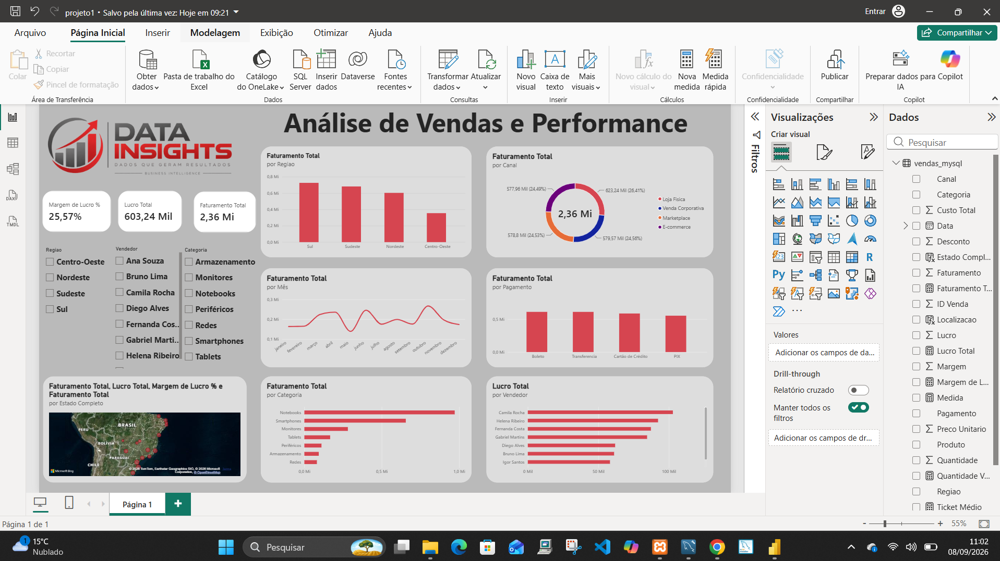

# 📊 Análise de Vendas e Performance | Power BI + MySQL

Projeto de Business Intelligence desenvolvido com o objetivo de analisar o desempenho comercial de uma empresa fictícia, transformando dados de vendas armazenados em MySQL em informações estratégicas por meio do Power BI.

## 🎯 Objetivo do Projeto

Desenvolver um dashboard comercial interativo capaz de facilitar a análise dos principais indicadores de vendas e apoiar a tomada de decisões baseada em dados.

O projeto contempla desde o armazenamento e consulta dos dados no MySQL até a criação de indicadores, análises e visualizações no Power BI.

## 🛠️ Tecnologias Utilizadas

- Power BI
- MySQL
- MySQL Workbench
- SQL
- DAX
- Power Query

## 📈 Indicadores analisados

O dashboard apresenta indicadores como:

- Faturamento Total
- Lucro Total
- Margem de Lucro %
- Faturamento por Região
- Faturamento por Canal de Venda
- Evolução do Faturamento por Mês
- Faturamento por Forma de Pagamento
- Faturamento por Categoria
- Lucro por Vendedor
- Distribuição geográfica das vendas

## 🗺️ Análise Geográfica

Foi implementado um mapa interativo para visualizar a distribuição das vendas por localização, permitindo analisar o desempenho comercial de diferentes regiões.

## 🎛️ Filtros Interativos

O dashboard permite segmentar as informações por:

- Região
- Vendedor
- Categoria

Os filtros atualizam dinamicamente os indicadores e gráficos apresentados.

## 🗄️ Banco de Dados

Os dados utilizados no projeto foram armazenados em um banco MySQL.

Banco:

`projeto_bi_vendas`

Tabela principal:

`vendas_mysql`

O arquivo SQL contendo a estrutura e os dados utilizados no projeto está disponível na pasta `sql`.

## 📂 Estrutura do Projeto

dashboard-comercial-powerbi/

- dashboard/
  - dashboard_comercial.pbix
- imagens/
  - dashboard_comercial.png
- sql/
  - projeto_bi_vendas.sql
- README.md

## 💡 Principais Aprendizados

Durante o desenvolvimento deste projeto foram aplicados conceitos de:

- conexão entre Power BI e MySQL;
- preparação e transformação de dados;
- consultas SQL;
- criação de medidas utilizando DAX;
- definição de KPIs;
- construção de dashboards;
- segmentação e filtros;
- análise geográfica;
- visualização e análise de dados;
- organização de um projeto de BI para portfólio.

## 👨‍💻 Autor

**Carlos Alberto Santos**

Estudante de Análise e Desenvolvimento de Sistemas, com foco no desenvolvimento de competências em Análise de Dados, Business Intelligence, SQL, Power BI e desenvolvimento de software.